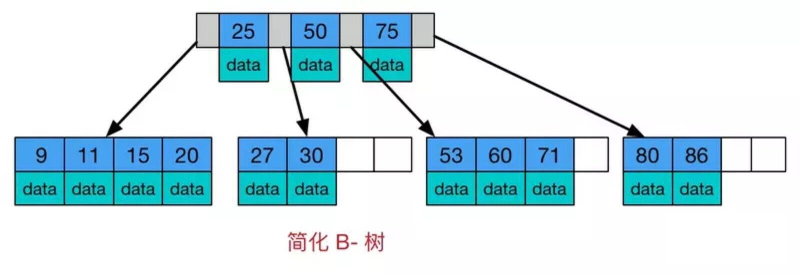
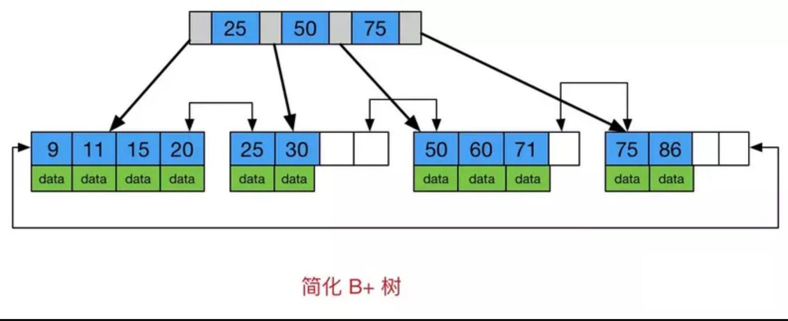
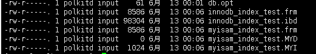
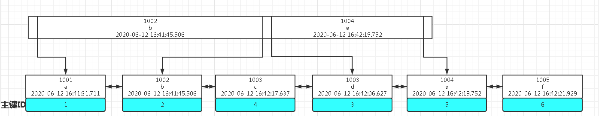

---
layout: post
title: Mysql 索引数据结构
categories: database
description: 索引是帮助MySQL高效获取数据的排好序的数据结构。
keywords: java,database
--- 

##Mysql 索引数据结构
**索引是帮助MySQL高效获取数据的排好序的数据结构**
* mysql 索引包含如下两种数据结构
  * BTREE
  * HASH 
  
  
我们创建索引时默认使用 BTREE，mysql 的 BTREE 是 B-Tree 的变种 B+Tree 
数据结构的演示可以在网站[https://www.cs.usfca.edu/~galles/visualization/](https://www.cs.usfca.edu/~galles/visualization/)中进行
###B-Tree

1~8依次插入，对于 mysql 索引，每个节点都存储索引相关数据 
* 节点中的数据从左到有一次递增
* 叶子结点具有相同的深度
###B+Tree

* 节点中的数据从左到有依次递增
* 1~8依次插入，对于 mysql 索引，只有叶子节点存储索引相关数据，可以看到叶子节点是带有指针的，从左到右依次为1~8，对于 mysql 来说，这里的指针是双向的，8也有指针指向1，双向指针也方便 mysql 对索引进行升序或降序排列。
* 由于索引存储的时候B+Tree已经对索引做好排序，所以使用 order by 对索引排序时 explain 的 Extra 中一般看不到 Using filesort

###Hash
* hash 表存储的数据，查询是非常快速的，快于B-Tree 但是只适合单值查询，因为各元素之间是没有指针关联，且是无序存放的，因此无法支持模糊查询，范围查询等，查找时用计算出来的hash码找映射表中存储数据的文件地址获取数据。

mysql 的索引树中每个节点的大小默认是 16384byte(16KB),可以通过以下语句查看
```mysql
mysql> SHOW GLOBAL STATUS LIKE 'Innodb_page_size';
+------------------+-------+
| Variable_name    | Value |
+------------------+-------+
| Innodb_page_size | 16384 |
+------------------+-------+
```
这个值是可以调节的,我所使用的mysql版本是
```mysql
Server version: 5.7.30 MySQL Community Server (GPL)
```
索引长度的计算
* 字符串  
  * char(n)：n字节长度 
  * varchar(n)：2字节存储字符串长度，如果是utf-8，则长度 3n + 2
* 数值类型
  * tinyint：1字节 
  * smallint：2字节 
  * int：4字节 
  * bigint：8字节 
* 时间类型
  * date：3字节 
  * timestamp：4字节 
  * datetime：8字节  
* 如果字段允许为 NULL，需要1字节记录是否为 NULL
###MyISAM 和 InnoDB 存储引擎索引实现

mysql data目录中 MyISAM 数据表的文件结构


* 其中 myisam 开头的为 MyISAM 存储引擎的表，innodb 开头的为 InnoDB 存储引擎的表。

* 可以发现 MyISAM 存储引擎的表是有三个文件，而 InnoDB 存储引擎的表只有两个文件

* 其中  
  * .frm 存储建表语句  
  * .idb 存储使用 innodb 存储引擎的表相关索引和数据文件  
  * .MYD 存储使用 myisam 存储引擎的表相关数据  
  * .MYI 存储使用 myisam 存储引擎的表相关索引

    MyISAM 索引文件和数据文件是分离的(非聚集)，通过索引中叶子节点存储的文件地址去查找数据返回。

    InnoDB 索引实现聚集，数据存储在主键索引数据结构的叶子节点，非主键索引的叶子节点只存储主键索引。
    所以建议 InnoDB表必须有主键，并且推荐使用整型的自增主键,否则 mysql 会自己生成隐藏的 row_id 列。
    非主键索引叶子节点不存储数据，而是存储主键索引，主要是为了一致性和节省空间，如果主键索引和非主键索引叶子节点都存储数据，会造成比如数据的更新时数据同步时的开销。
    通过非主键索引查找数据时，找到索引相关的叶子节点后会根据主键索引再到主键索引的B+Tree中继续查找数据返回，也就是我们说的回表，mysql会根据自己算法去估算直接查找还是通过索引去查找，因此有时会看到通过非主键索引查找数据时，有时候会用到 index，有时候没用到。

###联合索引的底层存储结构



以上结构可以解释最左前缀和覆盖索引等我们常说的mysql索引优化原理
* 最左前缀：如果匹配最左前缀，那么 mysql 查询的时候根据第一个联合索引字段匹配到查找范围，然后在匹配到的子节点中根据第二个字段去匹配（因为B-Tree的原理，小于父节点的数据存储在左边的子节点中，大于等于父节点的数据存储在右边的子节点中）；如果没有匹配最左前缀，mysql 要扫描整个索引树，匹配到第二个字段的节点，然后继续查找...
* 覆盖索引：如果联合索引不包含主键，那么覆盖索引（全值匹配）得话，mysql 从索引中就可以拿到数据，而不用再去回表查询，否则要去主键索引树中查找数据并返回。

